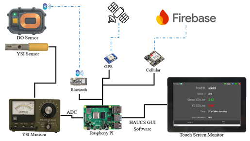

# HAUCS_GUI

HAUCS-GUI is a user-friendly graphical interface software developed for **real-time monitoring of dissolved oxygen (DO) levels** in aquaculture ponds using mobile sensors installed on a field truck.  
The software is designed to run on **Raspberry Pi 4 with a touchscreen**, requiring minimal interaction by the user.

---

## Purpose of the System
The system is intended to help farmers and field operators monitor DO levels efficiently and automatically, even without technical expertise.

Once powered on, the system:
- **Starts automatically**
- **Connects to Bluetooth DO sensors**
- **Displays real-time DO measurements**
- **Uploads results to the cloud (Firebase)**

Users can view current oxygen levels, switch between units (mg/L or % saturation), calibrate the sensor, and review the measurement history — all through a simple and intuitive touch interface.

---

## Key Features
- **Automated startup and data upload**
- **Touchscreen operation** with large fonts for outdoor readability
- **Automatic Pond ID detection via GPS**
- **DO sensor calibration** and history logs
- **Bluetooth-based DO measurement** with optional YSI sensor support
- **Offline operation** and data buffering when internet is unavailable

---

## System Architecture
The diagram below shows the hardware and data flow of the HAUCS-GUI system:



**Description:**
- **DO Sensor & YSI Sensor**: Capture dissolved oxygen data via Bluetooth or direct measurement.
- **Raspberry Pi + HAUCS GUI Software**: Processes the sensor data, stores it locally, and displays it on a **touchscreen monitor**.
- **GPS & Cellular Modules**: Provide location data and enable cloud synchronization via Firebase.
- **YSI Measure (ADC)**: Allows compatibility with analog sensors.

---
# Installation

## Enable I2C
Go to `sudo raspi-config` and enable i2c interface.

## Python Virtual Environment
Run the following commands to create a virtual environment
```
python3 -m venv truck --system-site-packages
```

## Clone Repository
Make sure to clone this repository in `/home/haucs/Desktop`. After cloning, install python libraries:

```
source /home/haucs/truck/bin/activate
cd /home/haucs/Desktop/HAUCS_GUI/code
pip3 install --upgrade pip
pip3 install -r requirements.txt
```
After cloning, place `fb_key.json` in the main folder. 

## Autostart Setup
To enable the GUI to start automatically on boot:

1. **Create the autostart directory:**
   ```bash
   mkdir -p ~/.config/autostart
   ```
2. Create a file named `gui.desktop` with the following content:
   ```bash
   [Desktop Entry]
   Type=Application
   Name=TRUCKGUI
   Exec=/home/haucs/Desktop/HAUCS_GUI/gui_start.sh
   ```
3. Save the `gui.desktop` file in:
   ```bash
   ~/.config/autostart
   ```

## `gui_start.sh` — Program Launcher Script
`gui.sh` is a shell script that launches the HAUCS-GUI software.

Make sure to set execute permission:
```bash
chmod +x /home/haucs/Desktop/HAUCS_CODE/gui_start.sh
```

## Sixfab Cellular Base Hat Setup

### ATCOM

Following this [guide](https://docs.sixfab.com/page/sending-at-commands) to setup and install `atcom` in the truck virtual environment.

### ECM Setup

Follow this [installation guide](https://docs.sixfab.com/page/cellular-internet-connection-in-ecm-mode) to setup the cellular hat in ECM mode. We are currently using the Quectel modems. 

### Reorder Priority

By default, the cellular modem, which shows up as `usb0`, has a higher priority than WiFi, `wlan0`. In order to connect to WiFi when present, run the following commands:

#### Retrieve Connection Name
```
nmcli connection
```
The name should be something like `Wired\ connection\ 2`.
#### Increase Metric for USB Connection
The interfaces with lower metrics will run first. Give the usb connection a higher priority than the WiFi connection. 
```
nmcli connection modify <connection-name> ipv4.route-metric 700
```
Reboot to the RPI when finished.
